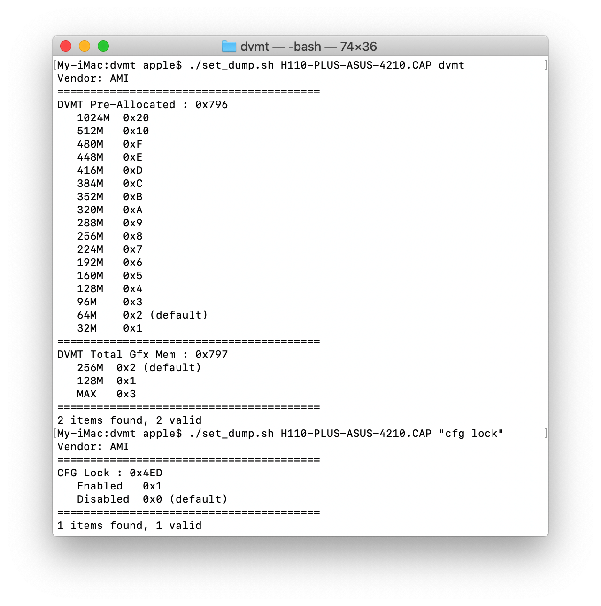

# set_dump
[简体中文](./README_cn.md)  
Find the ID of each setting item and its options from BIOS file.
### Usage
````
usage: set_dump file keyword [mode(Default: a)]
modes: a: auto detection
       m: AMI mode
       i: Insyde mode
       h: HP mode
e.g. : set_dump ROM.fd DVMT
       set_dump ROM.fd L
       if keyword is "L", the script will list all the settings
````
### Screenshots
  

