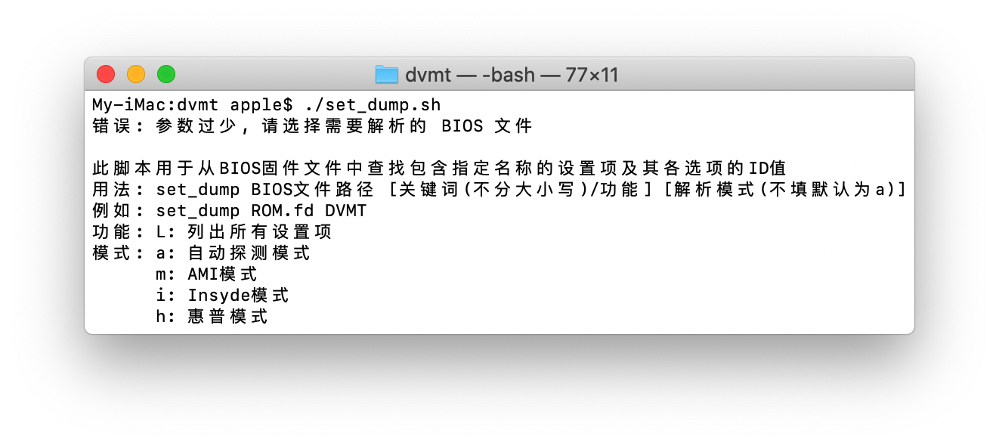
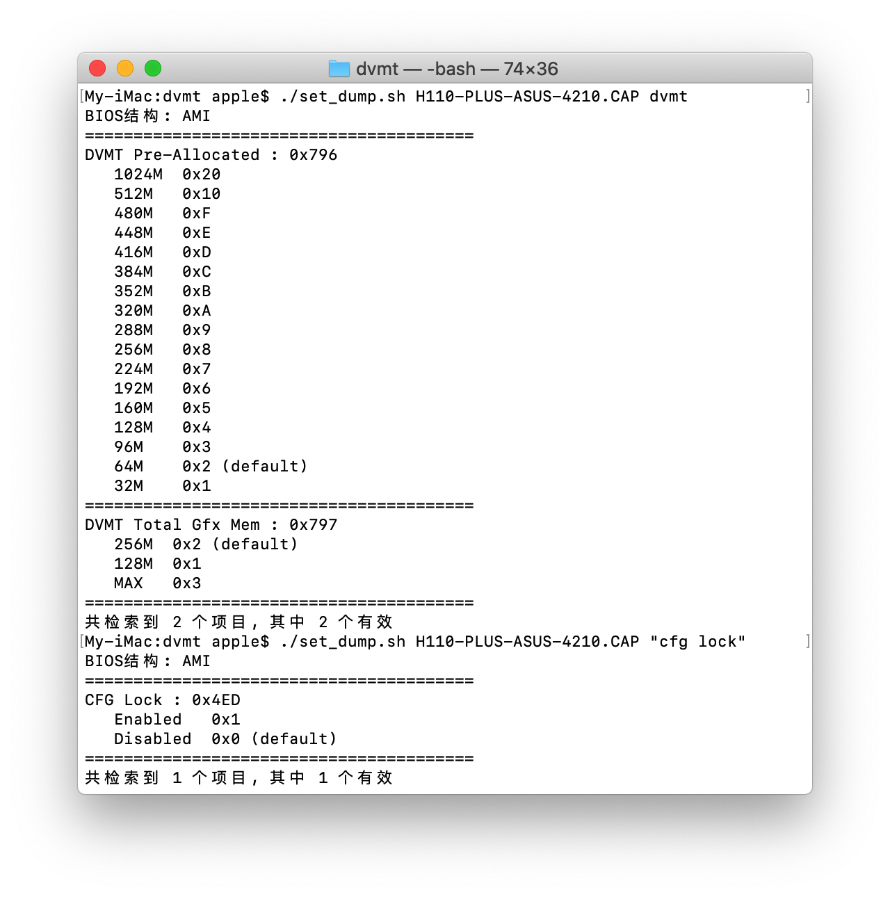

# set_dump  
[English](./README.md)  
此脚本用于从BIOS固件文件中查找包含指定名称的设置项及其各选项的ID值.  

### 依赖项目
[UEFIExtract 和 UEFIFind](https://github.com/LongSoft/UEFITool/releases)  
[ifrextract](https://github.com/LongSoft/Universal-IFR-Extractor/releases)  

### 用法
````
用法: set_dump BIOS文件路径 关键词 [解析模式(不填默认为a)]
模式: a: 自动探测模式
      m: AMI模式
      i: Insyde模式
      h: 惠普模式
例如: set_dump ROM.fd DVMT
      set_dump ROM.fd L
      当关键词为"L"时, 脚本将列出给定BIOS文件中的所有设置项名称
````

### 截图
  

